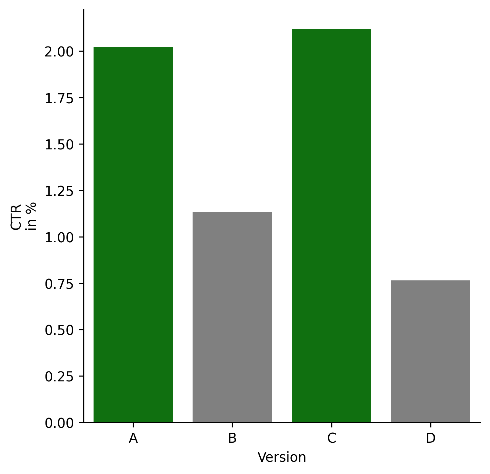
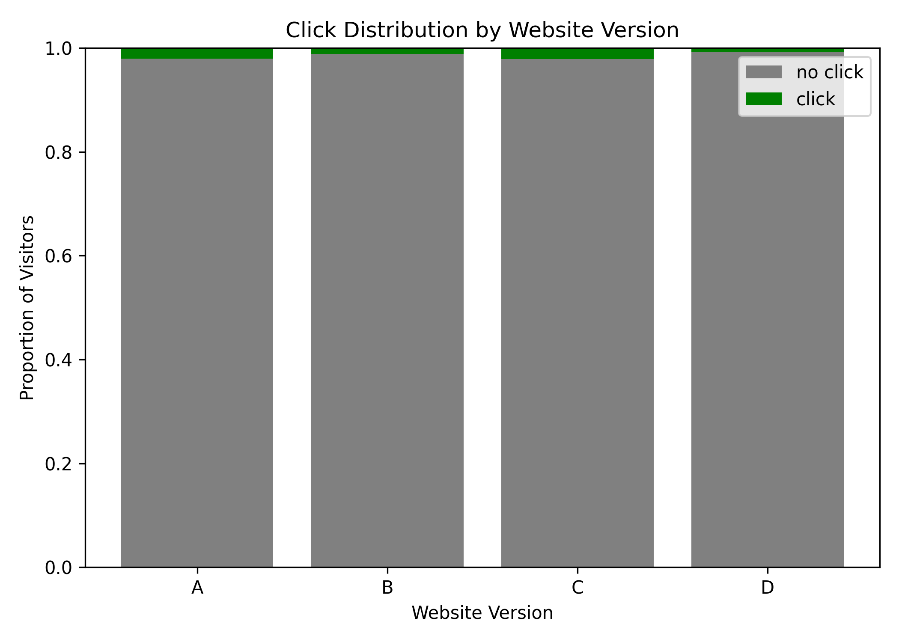
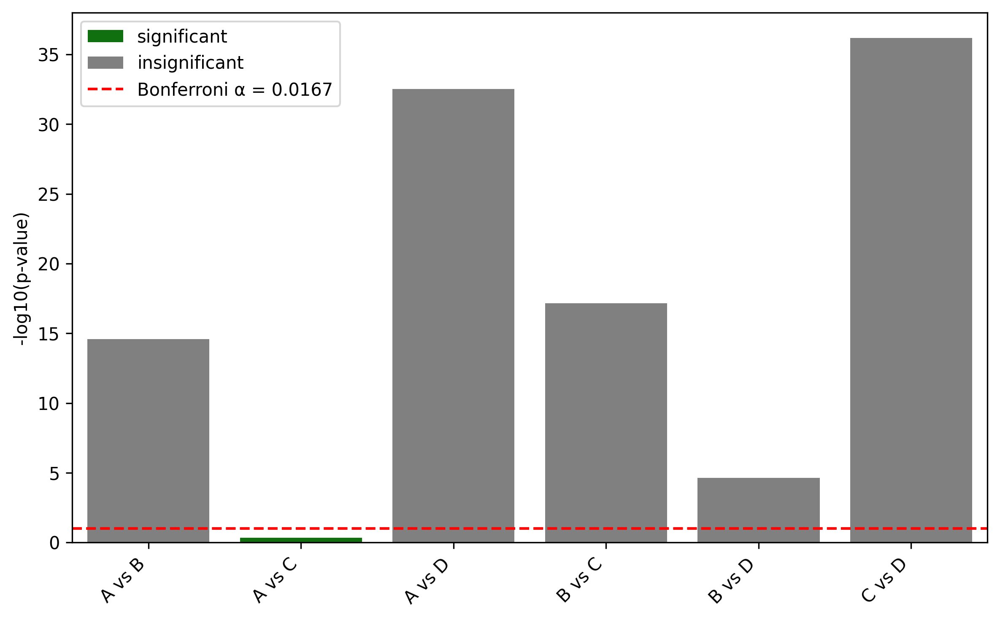

# Eniac Website Redesign – A/B Testing Analysis

## Project Overview

This project is a **fictional business case study** developed to demonstrate an end-to-end A/B testing workflow for an e-commerce scenario.

The analysis evaluates the impact of different website versions on user engagement and conversion behavior for **Eniac, a fictional e-commerce company**.

The goal is to determine whether different website designs lead to statistically significant differences in customer interaction and to provide a data-driven recommendation based on the test results.

Using Python, exploratory data analysis, and statistical hypothesis testing, four website variants (A, B, C, and D) were compared to identify meaningful differences in user behavior.

---

## Business Context

Eniac is a fictional e-commerce company testing multiple website designs to improve customer engagement and conversion performance.

The company wants to answer:

> **Do different website designs significantly influence user behavior, and which version should be selected for implementation?**

This case study simulates a real-world data analytics workflow where business decisions are supported by controlled experiments and statistical evidence.

---

## Dataset

The dataset contains user interaction data from four website variants.

The experiment evaluates the impact of different call-to-action (CTA) button designs:

| Version | Description |
|---|---|
| A | Control Group: Original website version with a white **"SHOP NOW"** button |
| B | Test Variant: **"SHOP NOW"** button changed to red |
| C | Test Variant: CTA text changed from **"SHOP NOW"** to **"SEE DEALS"** |
| D | Test Variant: CTA text changed to **"SEE DEALS"** and button color changed to red |

Each version contains information about:

- Number of visitors
- Click interactions
- User actions on the website
- Conversion-related metrics

---

# Project Objectives

The analysis aims to:

- Compare user engagement across different website versions
- Calculate conversion metrics
- Perform statistical hypothesis testing
- Determine whether observed differences are statistically significant
- Provide a data-driven recommendation for the website redesign

---

# Methodology

## 1. Data Preparation

The analysis included:

- Loading and combining datasets
- Extracting relevant metrics from raw interaction data
- Cleaning and transforming variables
- Preparing contingency tables for statistical testing

---

## 2. Exploratory Data Analysis

The following metrics were analyzed:

- Number of visitors per version
- Number of clicks
- Click-through rates (CTR)

The conversion rate was calculated as:

\[
Conversion\ Rate = \frac{Conversions}{Visitors}
\]

Visual comparisons were used to identify differences between website versions.

---

# Statistical Testing

## Chi-Square Test of Independence

To evaluate whether website version and user behavior are independent, a Chi-Square test was applied.

### Hypotheses

**Null hypothesis (H₀):**

> There is no significant difference in user behavior between website versions.

**Alternative hypothesis (H₁):**

> At least one website version produces significantly different user behavior.

Significance level:

\[
\alpha = 0.1
\]

---

## Multiple Comparison Correction

Since four website versions create multiple pairwise comparisons, a Bonferroni correction was applied to reduce the risk of false positives.

The adjusted significance level was calculated as:

\[
\alpha_{adjusted} = \frac{\alpha}{number\ of\ comparisons}
\]

---

# Visualizations

The following visualizations summarize the key findings of the A/B testing analysis.

## Click-Through Rate (CTR) Comparison

The CTR comparison shows the impact of different call-to-action (CTA) designs on user engagement.

Version C achieved the highest CTR, while versions B and D showed a substantial decrease compared to the original website version (A).

However, statistical testing is required to determine whether these differences are significant.




---

## Click Distribution by Website Version

This 100% stacked bar chart shows the proportion of visitors who clicked or did not click the CTA button for each website variant.

The visualization highlights that all versions received a comparable number of visitors, while click behavior differed between variants.




---

## Chi-Square Test Results

Pairwise Chi-Square tests were performed to evaluate whether differences between website versions were statistically significant.

The p-value comparison includes the Bonferroni-adjusted significance threshold:

\[
\alpha_{adjusted}=0.0167
\]

Results indicate significant differences for most comparisons, while version A and C did not show a statistically significant difference.


---

# Results

Pairwise Chi-Square tests showed the following results:

**Bonferroni adjusted alpha: 0.0167**

| Comparison | p-value | Result |
|---|---:|---|
| A vs. B | 2.6731e-15 | Significant difference |
| A vs. C | 4.6484e-01 | No significant difference |
| A vs. D | 3.0809e-33 | Significant difference |
| B vs. C | 6.9555e-18 | Significant difference |
| B vs. D | 2.3573e-05 | Significant difference |
| C vs. D | 6.4505e-37 | Significant difference |

---

# Key Findings

The analysis indicates that:

- **Version A and C show no statistically significant difference**
- **All other combinations show statistically significant differences**

This suggests that user behavior differs significantly depending on the website version.

---

# Business Recommendation

The analysis shows that changing the call-to-action button design had a significant impact on user behavior.

| Version | CTR | Interpretation |
|---|---:|---|
| A (Control) | 2.02% | Baseline performance |
| B ("SHOP NOW" in red) | 1.14% | Significant decrease compared to control |
| C ("SEE DEALS") | 2.12% | Highest CTR, but no significant improvement over control |
| D ("SEE DEALS" + red button) | 0.76% | Significant decrease compared to control |

Key findings:

- Version C achieved the highest click-through rate (CTR), but the improvement compared to the original version A was not statistically significant.
- Changing only the button color (Version B) significantly reduced user engagement.
- Combining the new wording with the red button (Version D) resulted in the lowest performance.

Based on statistical significance and practical business impact, the recommendation would be to keep the original design (Version A). Although Version C shows a slightly higher CTR, there is insufficient statistical evidence that it provides a real improvement.

---

# Technologies Used

- Python
- Pandas
- NumPy
- SciPy
- Matplotlib
- Seaborn
- Google Colab

---

# Repository Structure

```text
Eniac-AB-Test/
│
├── README.md
├── requirements.txt
├── .gitignore
│
├── data/
│   ├── eniac_A.csv
│   ├── eniac_B.csv
│   ├── eniac_C.csv
│   └── eniac_D.csv
│
├── notebooks/
│   └── Eniac_ABTesting.ipynb
│
└── reports/
    └── figures/

```
---

# Author

**Dr. Florian Hastreiter**  
Junior Data Analyst | Analytics Engineer

GitHub:  
[github.com/FlorianHast](https://github.com/FlorianHast)
